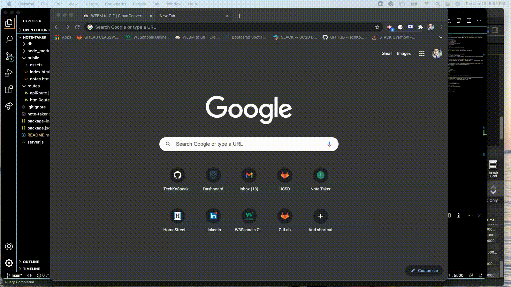

# Note-Taker

## Description

This is a working application that can be used to write, save, and delete notes within a browser. This application uses an express backend server to save and retrieve note data from a JSON file. This app is also deployed via Heroku as opposed to the traditional GitHub.

## Table of Contents

- [Description](#description)
- [User Story](#user-story)
- [Guidelines](#guidelines)
- [Testing](#testing)
- [Technologies Used](#technologies-used)
- [Working Application](#working-application)
- [License](#license)
 

## User Story

AS A user, I want to be able to write and save notes
 
I WANT to be able to delete notes I've written before
 
SO THAT I can organize my thoughts and keep track of tasks I need to complete
 
 

## Guidelines:

Utilizing GET /notes - will return the notes.html file.

GET * - will return the index.html file

The application also has a db.json file on the backend that is utilized to store and retrieve notes using the fs module.

The following API routes should be created:

GET /api/notes - Should read the db.json file and return all saved notes as JSON.

POST /api/notes - Should receive a new note to save on the request body, add it to the db.json file, and then return the new note to the client.

DELETE /api/notes/:id - Should receive a query parameter containing the id of a note to delete. This means you'll need to find a way to give each note a unique id when it's saved. In order to delete a note, you'll need to read all notes from the db.json file, remove the note with the given id property, and then rewrite the notes to the db.json file.

## Technologies Used

- APIs
- node.js
- JSON
- Heroku
- Arrow Functions
- Back End Server function
- Unit Testing
- Classes
- Inheritance
 
 

## Testing

Full application is deployed at: https://hidden-coast-19667.herokuapp.com/
 
To test separate from heroku:
 
In the integrated terminal within the Note Taker folder, run these commands:
 
<strong>npm i</strong>    -    Installs the required json packages
 
<strong>node server.js</strong>     -      Will start the server listening at port 7000
 

Go to your browser and type in :
<strong>http://localhost:7000</strong>

## Working Application
Working App on Heroku:

Testing through Terminal

## License
 
This is licensed under MIT.
 
© 2021 Travis Ko Coding